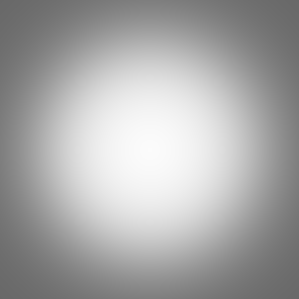
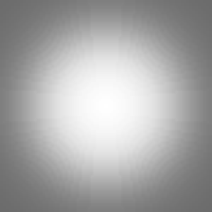
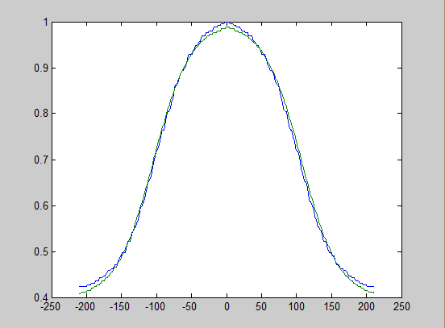
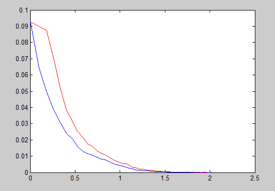
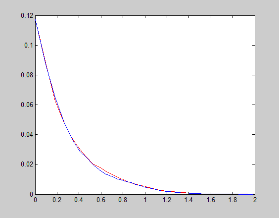

Vignetting Correction
======================

The code is implemented according to paper of *Single-Image Vignetting Correction*,by Yuanjie Zheng,Stephen Lin,etc.Both c++ and Matlab source codes are provided. For the Matlab version, I revise some parts of the code offered by the author, Yuanjie Zheng. For the C++ version, it iss implemented by my supervisor, Donghai Xie and me.    

## C++ version:
======================
Before compiling the source code, please make sure you have configured the OpenCV open source library properly. For C++ version, there are 2 projects. *Vignetting* project is used to produce vignet for images. *Vignetting correction* project is used to correct the vignetting on the images.

## Matlab version: 
======================
Copyright (c) 2010, Yuanjie Zheng
All rights reserved.      
For the Matlab version, you can run the *demo_vignetting* module to start the correction process. There is also another module called *Estimate*, which is used to estimate the performance of the correction. See *Correction Estimate* part or the paper material for details.
    
## Results    
======================

### Lena   
   
##### Corrected               
    
   
### Sea   
   
##### Corrected                
 
                         
### Couple   
    
##### Corrected      
       
     
## Performance Estimate       
We estimate the performance from 2 perspectives. 
First, since we can produce the vignetting function through the C++ project *Vignetting*, we can compare the vignetting function defined by ourselves with the vignetting function we calculate through the correction process.       
##### Real Vignetting Function     
  
##### Estimate Function     
       

If we fit value along the diagonal of the 2 images above, we can get a result like this.
##### Fit
       
    
Second, according to the paper, the radius gradient distribution of image without vignetting should be centrosymmetry. Thus, we can calculate the value of log(1+|x|),where x represents the radius gradient value, to see whether the 2 sides of the distribution overlap with each other. And we can get the result like this.
##### Before Correction    
   
##### Corrected Result    
 